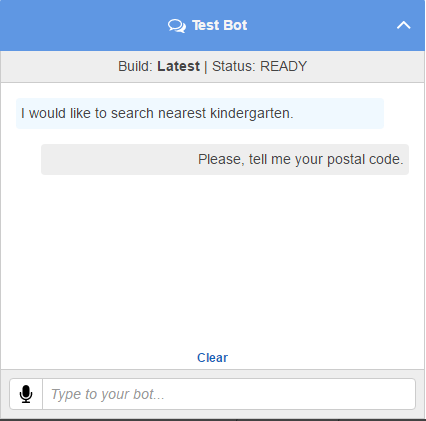
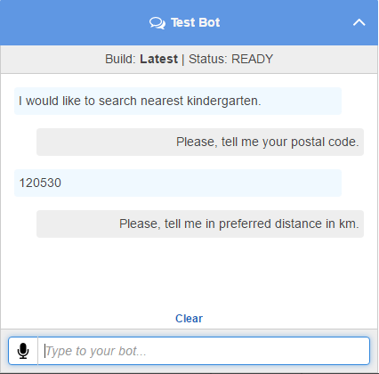
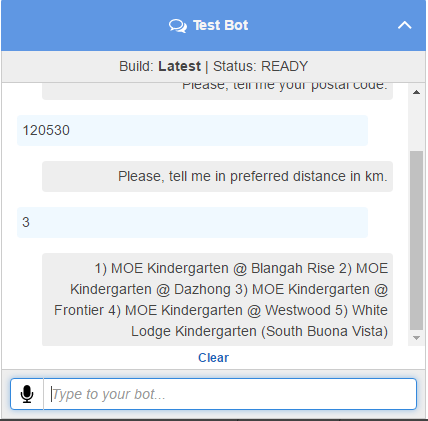
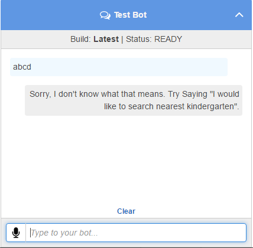
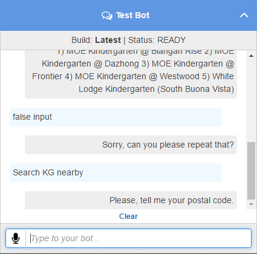

# Kid-n-Roll

Kid-n-Roll is a kindergarten enrollment app for busy parents and kindergarten centers. Parents can search for suitable kindergarten centers and enroll their child. Kindergarten centers can manage their enrollment process through Kid-n-Roll website.
Kid-n-Roll will be implemented using IaaS and/or PaaS technologies and provisioned as a Software-as-a-Service (SaaS) to kindergarten centers. The centers can register for
free tier - with only publishing center details
premium tier - with all features

# Criteria that we plan to implement

## Simple proof-of-concept web application that performs following functions

### As a parent

- search kindergarten center (based on location and price)
- view center detail
- submit enrollment

### As a kindergarten center manager

- register for free/premium tier
- publish center detail
- customize enrollment form and period
- process enrollment records
- notify parents via email/sms to complete the enrollment process in-person at the center.

### Simple proof-of-concept chat-bot that performs following functions As a parent

- search kindergarten center
- view center detail
- submit enrollment

## Chatbot

- Chat Bot is implemented using **Amazon Lex and Amazon Lambda.**
- Amazon Lex provides conversional user interface while Amazon Lambda is used to interface between chat bot and NodeJs web application.
- NodeJs Web Application provides a simple REST API that returns nearby kindergarten centers to a given postal code. Amazon Lambda uses the API to provide search results to chat bot.

### Chat Bot in action

#### Typical flow.

>  >  >  >  > 
